# PureDashboard

**Build an embedded admin dashboard with nothing but the browser.**

PureDashboard is a **complete** UI component library for apps that need a real
dashboard UI — 50+ components spanning forms, tables, navigation, data display,
feedback, overlays and layout, plus a router, safe Markdown, and even native-style
desktop window chrome — but **don't want to drag in a frontend framework, a bundler,
and a 200 MB `node_modules`** to get one.

It's plain ES modules and standard DOM. **No dependencies. No build step. No
minification. No transpile.** The files you write are the files that ship — so what
you read *is* what runs in the browser, auditable line by line. Drop the folder into
your backend, `import` what you need, and serve it.

## Showcase

The very same `<puredashboard-table>` — themed **dark** with English labels, and
**light** with Vietnamese labels. No config and no rebuild: the components read your
design tokens (light/dark) and a `labels` object (any language), and the optional
[theme](#a-cohesive-look-the-optional-theme) supplies the cohesive frame.

| English · dark | Tiếng Việt · light |
|:--:|:--:|
| 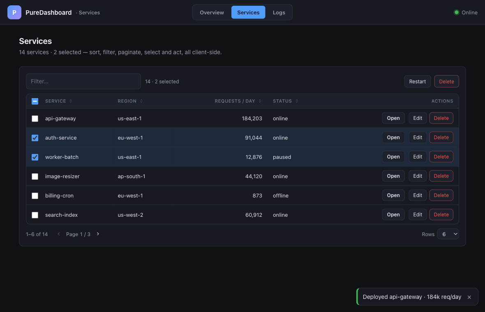 | 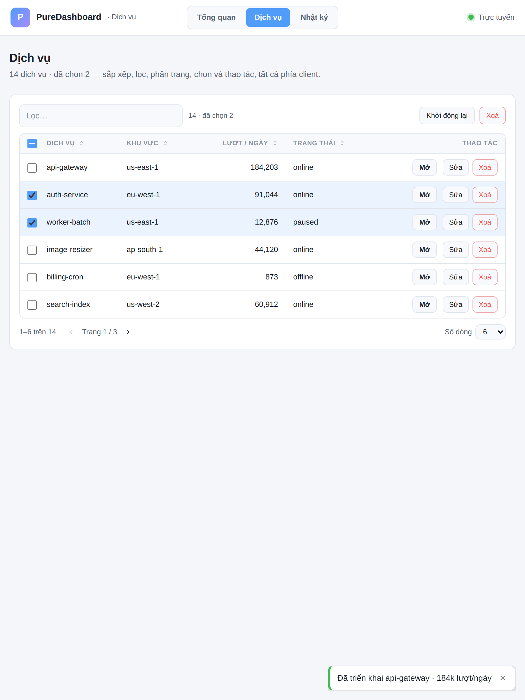 |

<sub>Sortable columns · filter · pagination + rows-per-page · row selection with a bulk-action bar · per-row actions · a top-layer toast — all client-side, all zero-dependency.</sub>

…and a whole dashboard assembled from nothing but PureDashboard components — top bar,
nav, KPI cards, alerts, lists, a timeline and progress meters:

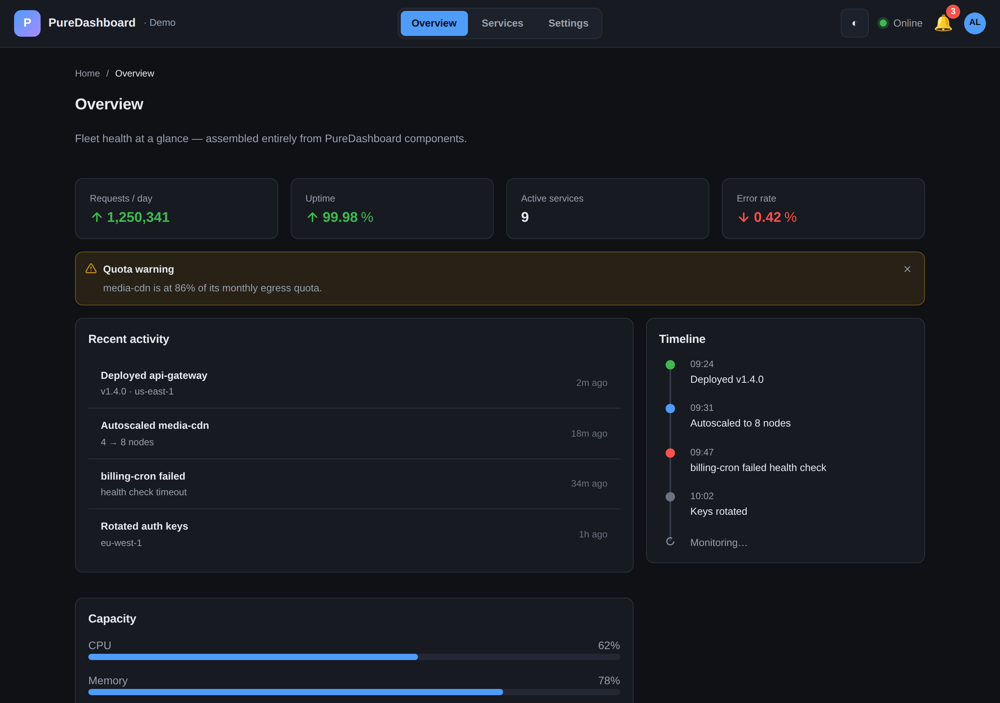

<sub>The demo above is real, runnable code — `test/dashboard.html` (serve the repo and open it).</sub>

**The platform guarantees**

- 🚫 **Zero dependencies** — no npm packages at runtime, nothing to vet or patch.
- 🛠️ **No build / no bundler** — no transpile, no minify; the files you write are the files that ship.
- 🔒 **CSP-safe** — no `eval` / `new Function`; runs under a strict `script-src 'self'`.
- 📦 **Embeds straight into a backend binary** — `//go:embed` the folder and ship the whole UI; works equally from any static file server or `file://`.
- 🔎 **Transparent & verifiable** — no build, no minify, no transpile, so the source *is* the artifact: what you read is exactly what runs. Plain ES modules + standard DOM you can diff, review, and pin — nothing hidden in a bundle.

**What you get — a complete component catalog (50+)**

- 🧱 **General & layout** — `button`, a `copy`-to-clipboard button (text, rich HTML **or images**), `segmented`, a two-state `toggle` (+ `toggle-group`), `divider`, `space`, `flex`, 24-column `grid` (`row`/`col`), a page-scaffold `layout` (`header`/`sider`/`content`/`footer`), and a draggable `splitter`.
- 📝 **Forms** (all form-associated — real `submit` + validity via `ElementInternals`) — `input`, `textarea`, `number`, `select`, `combobox`, `checkbox`, `switch`, `radio-group`, `slider`, `date`, `time`, `color`, `rate`, and a `form` wrapper.
- 🧭 **Navigation** — `tabs`, `breadcrumb`, `pagination`, `steps`, a collapsible sidebar `nav`, a desktop-style `menubar`, and a `router` (hash or History API, params, catch-all 404, lazy pages, layouts, guards).
- 📊 **Data display** — `table` (sort · filter · paginate · row-select + bulk actions · per-row actions), `card`, `descriptions`, `statistic`, `tag`, `badge`, `avatar`, `list`, `tree`, `collapse`, a `json-view` (collapsible JSON tree — 10 built-in themes, `level` auto-collapse, per-value copy), `timeline`, `empty`, XSS-safe `markdown`, and a `lazy` wrapper that defers building expensive items until they scroll into view.
- 💬 **Overlays** (native top layer) — `dialog` / `drawer` / `alert` / `confirm` / `prompt`, anchored `menu()`, `tooltip`, `popover`, `popconfirm`, and `toast` — focus-trapped, Esc/backdrop/light-dismiss.
- 🔔 **Feedback** — `alert`, `progress` (line + circle), a `meter` gauge (native `<meter>` colour zones), `spinner`, `skeleton`, `result`.
- 📤 **File upload** — drag-and-drop, image thumbnails, per-file progress, native multipart submit.
- 🖥️ **Native-style desktop** — a custom `titlebar` for frameless Tauri/Wails/Electron windows and an optional macOS **skin** (`theme/native.css`, vibrancy + hairlines). See [DESKTOP.md](docs/DESKTOP.md).
- ⚡ **Reactive engine** (`reactive.js`) — a lit-html-style template engine that diffs the DOM **in place**, so `<input>` focus, caret and scroll survive re-renders.
- 🎨 **Self-contained theming** — one stylesheet per component, themed through a `--pd-*` token chain; looks right with zero config and auto-adapts to light/dark. An **optional [theme](#a-cohesive-look-the-optional-theme)** (`src/theme/`) adds a cohesive palette + dashboard frame in one link.

<sub>Full API for every component: [`src/_components.jsonl`](#documentation) · preview them all in the gallery (`test/gallery.html`).</sub>

---

## Why this exists

**The frontend code you _didn't_ write is the biggest risk you ship.** A typical
"lightweight" dashboard still pulls a framework, a bundler, and a dependency tree of
_hundreds_ of transitive packages — each one code from a maintainer you've never met,
running with full access to your users' sessions, tokens, cookies and DOM. Almost
nobody audits that tree. It _is_ your attack surface — and it has been attacked,
repeatedly and at scale:

- **`axios` compromise — March 2026.** A single hijacked maintainer account turned
  `axios`, the JavaScript ecosystem's most popular HTTP client (**100M+ downloads a
  week**), into a delivery vehicle for a cross-platform remote-access trojan. The
  intrusion was attributed to a North Korean threat actor (UNC1069), and prompted a US
  [CISA alert][axios].
- **TanStack "Mini Shai-Hulud" worm — May 2026.** A self-propagating worm published 84
  malicious versions across 42 `@tanstack/*` packages and spread through **160+** npm
  and PyPI packages, stealing credentials as it went. It reached inside **OpenAI** (two
  employee devices, with even its app-signing keys impacted and re-issued), Mistral AI,
  and UiPath — see [OpenAI's own postmortem][tanstack].
- **Red Hat `@redhat-cloud-services` "Miasma" — June 2026.** An attacker bypassed code
  review and pushed a malicious payload across **32** packages under a trusted vendor's
  npm namespace ([RHSB-2026-006][miasma]).

These are not outliers — they are _this year_, and they keep coming (the `node-ipc`
library, 10M+ downloads/week, was hit days after TanStack). The cadence of registry and
account-takeover attacks has only accelerated, and your admin panel — the surface with
the _most privileged_ users — is exactly where a transitive dependency you never chose
does the most damage.

[axios]: https://www.cisa.gov/news-events/alerts/2026/04/20/supply-chain-compromise-impacts-axios-node-package-manager
[tanstack]: https://openai.com/index/our-response-to-the-tanstack-npm-supply-chain-attack/
[miasma]: https://access.redhat.com/security/vulnerabilities/RHSB-2026-006

PureDashboard's answer is to **remove the surface, not monitor it**:

- **No third-party JS → no supply chain.** There is no `node_modules`, no transitive
  tree, no registry account that can be phished into your build. `npm install` is never
  run, so there is simply _nothing to hijack_. The browser already ships the hard parts
  — HTML parser, native `<dialog>`, the top layer, the Popover and History APIs, custom
  elements — and the library just _orchestrates_ them. PureDashboard itself is **not
  published to any registry** either: you get it as source you can read and pin (see
  [Install](#install)) — there is no package to be hijacked, and any registry entry by
  this name is an impostor.
- **CSP-safe by construction.** No `eval`, no `new Function`. It runs under a strict
  `script-src 'self'`, so even an injected string can't become executing code — a real
  requirement for internal/admin tooling.
- **You own every line — and every line is readable.** It's plain ES modules with **no
  build, no minify, no transpile**, so the source *is* the shipped artifact: what you
  review is exactly what runs, byte for byte. Nothing is hidden inside a bundle, and
  there's no generated blob to trust. Pin a tag, read it, diff the next one — a real
  code review, not a version bump you hope is fine. No upstream churn, no breaking
  majors, no lockfile to watch. Need a change? **Open the file and edit it.** It's yours
  to fork, patch, and keep.

This makes it a good fit for embedded/admin UIs where the frontend should be a thin,
safe, dependency-free layer over the backend — and a poor fit for large public SPAs
that genuinely need a full framework.

---

## What's inside

Every component is a self-contained `*.js` + `*.css` pair (one stylesheet each, themed
via the `--pd-*` token palette — link only what you use). The full, machine-readable
API for all 50+ lives in [`src/_components.jsonl`](#documentation). Underneath them sit
a few **shared modules** — the engine and the standalone utilities:

| Module        | Exports                                                       | Purpose                                                                                                                                                                        |
| ------------- | ------------------------------------------------------------- | ------------------------------------------------------------------------------------------------------------------------------------------------------------------------------ |
| `reactive.js` | `Reactive`, `html`, `repeat`, `renderResult`                  | **The core.** A lit-html-style template engine that diffs the DOM **in place** (so `<input>` focus/scroll survive re-renders) + a `ReactiveElement`-style custom-element base. |
| `html.js`     | `html`, `raw`, `icon`, `escapeHTML`                           | Lightweight **string → innerHTML** templating (escapes by default). For one-shot output, not in-place diffing.                                                                 |
| `dialog.js`   | `dialog`, `drawer`, `alert`, `confirm`, `prompt`              | Native `<dialog>` overlays (modal/drawer + alert/confirm/prompt).                                                                                                              |
| `menu.js`     | `menu()`                                                      | Anchored dropdown / action menu in the top layer — icons, shortcut hints, groups, checkbox & radio items, nested submenus.                                                      |
| `toast.js`    | `toast` (+ `.success/.error/.warn/.info`)                     | Transient notifications in the top layer.                                                                                                                                      |
| `router.js`   | `Router`                                                      | Zero-config SPA router (hash or History API, params, lazy modules, layouts, guards).                                                                                           |
| `md.js`       | `<puredashboard-markdown>`, `renderMarkdown`, `parseMarkdown` | XSS-safe Markdown → DOM (textContent-only, href whitelist). For **untrusted** content.                                                                                         |

### The catalog, up close

| Forms (form-associated) | Data display | Feedback |
|:--:|:--:|:--:|
| 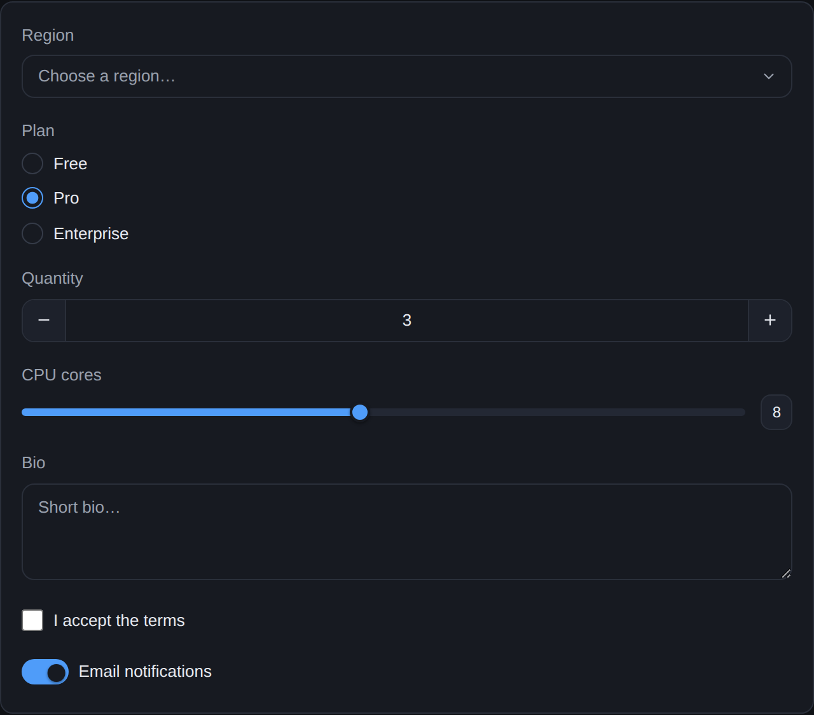 | 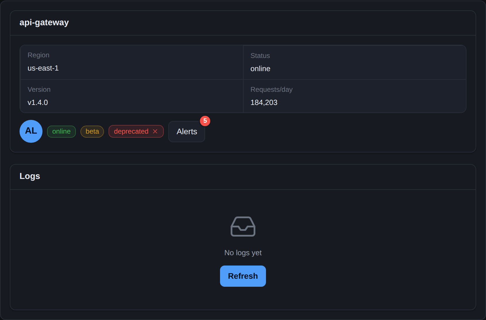 | 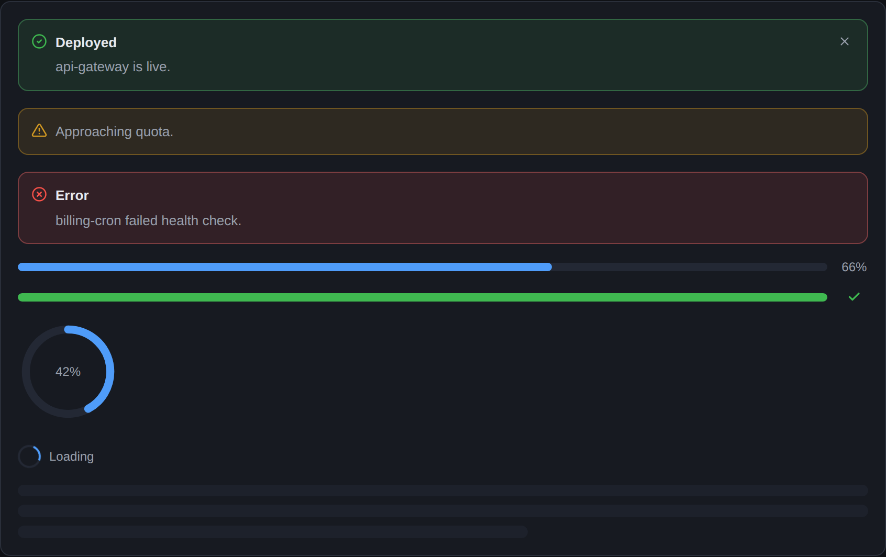 |

| Navigation | Dialog (native `<dialog>`) | Action menu (top layer) |
|:--:|:--:|:--:|
| 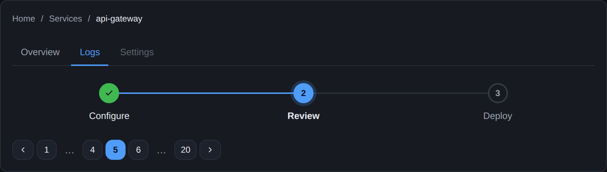 | 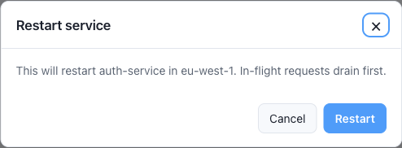 | 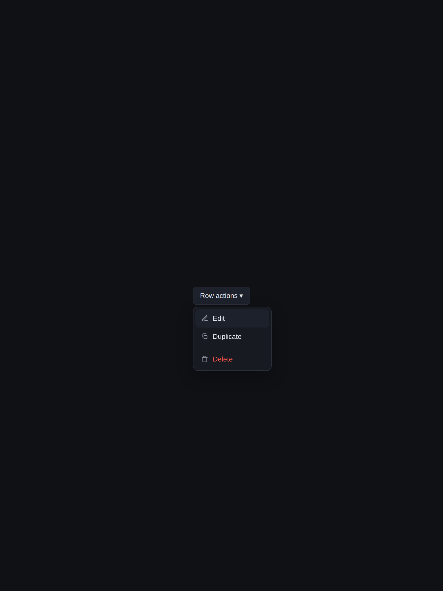 |

| Toasts (top layer) | Drag-and-drop upload | Safe Markdown (`textContent`-only) |
|:--:|:--:|:--:|
| 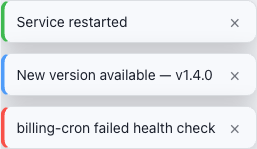 | 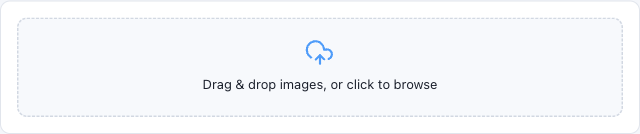 | 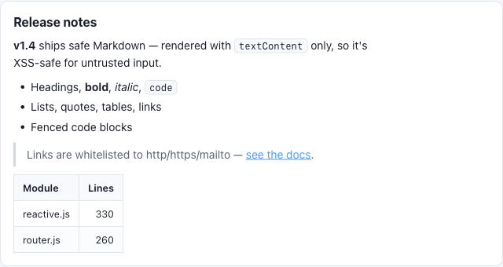 |

### Native-style desktop (Tauri / Wails / Electron)

A custom `<puredashboard-titlebar>` for frameless windows plus an optional macOS **skin**
(`theme/native.css` — vibrancy, hairlines, macOS controls) turn the same components into
a native-feeling desktop app. Recipe: [docs/DESKTOP.md](docs/DESKTOP.md).

| Frameless macOS window · dark | · light |
|:--:|:--:|
| 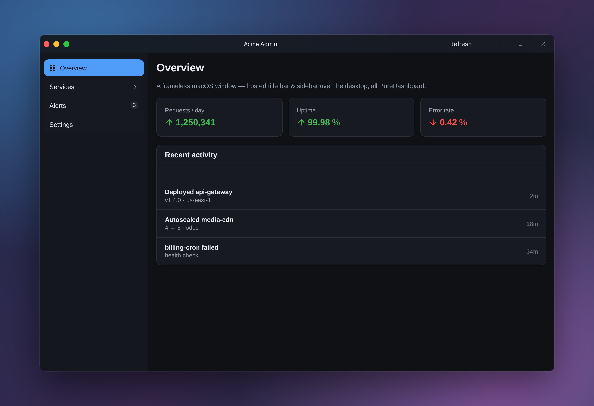 | 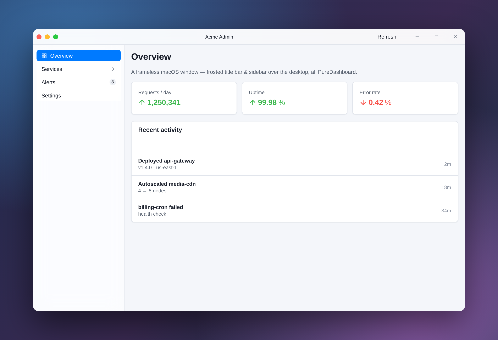 |

---

## Install

PureDashboard is **distributed as source, not as a package.** There is deliberately
**no entry on npm, jsr, or any other registry** — getting it never runs a registry
client, never resolves a dependency tree, and never executes a `postinstall` script.
That *is* the security model (see [Why this exists](#why-this-exists)): a package
manager is the exact attack vector this library avoids.

> ⚠️ **There is no official npm (or any registry) package.** If you find
> `puredashboard` — or anything similarly named — published on npm/jsr/etc., it is
> **not ours**: treat it as a typosquat / supply-chain impersonation and do **not**
> install it. The only authentic sources are **this repository's code** and its tagged
> **[Releases]**. Verify what you copy.

Get the code one of these ways, then copy `src/` into your project's web assets:

**A. Download a release** *(recommended — pinned and verifiable)*

```sh
# Download a tagged tarball from the Releases page, then:
tar -xzf puredashboard-vX.Y.Z.tar.gz
cp -r puredashboard-*/src  your-app/web/vendor/puredashboard
```

**B. Clone the repo**

```sh
git clone https://github.com/madnh/puredashboard.git
cp -r puredashboard/src  your-app/web/vendor/puredashboard
```

**C. Vendor it as a git submodule** *(tracks a pinned commit; you update on your own schedule)*

```sh
git submodule add https://github.com/madnh/puredashboard.git vendor/puredashboard-src
cp -r vendor/puredashboard-src/src  your-app/web/vendor/puredashboard
```

There is **nothing to build or compile** — `src/*.js` and `*.css` are the final files a
browser loads. Pin to a release tag (or commit) and audit it once; nothing changes
under you until *you* pull a newer one. Then link the CSS and `import` the JS you need
(below), or bake the folder into a single binary (Go: `//go:embed` —
[details](docs/USAGE.md#embedding-in-a-backend-go)).

[Releases]: https://github.com/madnh/puredashboard/releases

---

## Quick start

```html
<link rel="stylesheet" href="LIB/theme/dashboard.css" /> <!-- optional: the cohesive look -->
<link rel="stylesheet" href="LIB/table.css" />
<script type="module">
  import { confirm } from "./LIB/dialog.js";
  import { toast } from "./LIB/toast.js";
  import "./LIB/table.js"; // defines <puredashboard-table>

  const t = document.createElement("puredashboard-table");
  t.columns = [{ key: "name", label: "Name", sortable: true }];
  t.rows = nodes;
  t.selectable = true;
  t.bulkActions = [{ name: "delete", label: "Delete", danger: true }];
  t.addEventListener("bulkaction", async (e) => {
    if (await confirm(`Delete ${e.detail.rows.length} rows?`))
      toast.success("Deleted");
  });
  document.body.append(t);
</script>
```

Replace `LIB/` with wherever you dropped the folder. Then embed it into your backend —
see **[Embedding in a backend (Go)](docs/USAGE.md#embedding-in-a-backend-go)**.

---

## A cohesive look: the optional theme

Every component is **token-driven** — it reads your `--accent`, `--panel`, `--border`,
… (with safe system-colour fallbacks). So you have two choices, and both are valid:

1. **Bring your own tokens.** Define the `--*` variables in your app CSS and the
   components theme themselves to match. Nothing else needed.
2. **Use the shipped theme** (`src/theme/`) — an opt-in, zero-config palette + frame
   that produces the harmonious dashboard in the [Showcase](#showcase) above:

   | File | What it gives you |
   |------|-------------------|
   | `theme/tokens.css` | The **palette** (light/dark) — the one file that makes the components look polished instead of bare system colours. |
   | `theme/base.css` | Reset, typography, and themed `button` / `input` / `select` / `code`. |
   | `theme/shell.css` | The dashboard **frame**: top bar (brand + nav tabs + status), scrollable `main`, `.page`, `.card`, `.toolbar`. |
   | `theme/dashboard.css` | **All three in one** — link just this for the full look. |

   ```html
   <link rel="stylesheet" href="LIB/theme/dashboard.css">  <!-- everything -->
   <!-- …or only the palette, and lay things out yourself: -->
   <link rel="stylesheet" href="LIB/theme/tokens.css">
   ```

   Dark by default, light via `prefers-color-scheme`. Force a mode regardless of the OS
   with `<html data-theme="light">` / `data-theme="dark">`. Override any token from your
   own CSS to retheme everything at once. Full details in
   [USAGE.md → Theming](docs/USAGE.md#theming).

---

## Documentation

- **[docs/ARCHITECTURE.md](docs/ARCHITECTURE.md)** — how it works: the two-`html`-tag
  templating model, the parts engine, the `Reactive` base, the three component
  families, router, safe markdown, theming. **Start here to understand the codebase.**
- **[docs/USAGE.md](docs/USAGE.md)** — how to use it: drop-in, embedding in a Go (or
  any) backend + CSP, composing overlays, theming, per-component API.
- **[docs/DEVELOPMENT.md](docs/DEVELOPMENT.md)** — how to extend it: design rules, the
  add-a-component recipe, and testing.

**Building with an AI agent?** The reference an agent needs travels *inside* `src/`
(so it's there after you copy the folder), and is skipped by the `//go:embed` walker
so it never bloats your binary:

- **[`src/_agents.md`](src/_agents.md)** — golden rules, copy-paste recipes (forms,
  overlays, router, theming) and a full component index. Point your agent here first.
- **`src/_components.jsonl`** — the complete, machine-readable API as **one JSON line
  per component** (props, attributes, events, CSS custom properties, and a usage
  example). One line = one component, so an agent greps the single line it needs and
  pipes it to `jq`/node/python — no need to load the whole file. Generated from the
  JSDoc via the [Custom Elements Manifest][cem] analyzer; regenerate with
  `make -C tools/api-reference` after JSDoc changes.

**Preview every component:** serve the repo (`python3 -m http.server`) and open
`test/gallery.html` — a mini component gallery (built from the reusable
`<puredashboard-gallery>` element). Capture screenshots of all of them with
`make -C test/visual`.

[cem]: https://github.com/webcomponents/custom-elements-manifest

---

## Repo layout

```
puredashboard/
├─ src/        ← the library — ship these
│  ├─ *.js     ← components + engine
│  ├─ *.css    ← one self-contained stylesheet per component
│  ├─ theme/   ← optional tokens + base + dashboard shell + native (macOS) skin
│  ├─ _agents.md         ← guide for AI agents (travels in src/, skipped by go:embed)
│  └─ _components.jsonl  ← machine-readable API, one line per component
├─ test/       ← jsdom tests + demo harnesses (gallery, dashboard, desktop, showcase) — dev-only
├─ tools/      ← dev-only generators (api-reference → src/_components.jsonl)
└─ docs/       ← architecture, usage, development, desktop guides + images
```

Only `src/` reaches production (`test/`, `tools/`, `docs/` are dev-only and stay out of
the go:embed binary). Tests run in a throwaway Docker image so the runtime stays
strictly zero-dependency — `make -C test`. See
[DEVELOPMENT.md](docs/DEVELOPMENT.md#testing).

---

## Project

- 🐛 **Found a bug / have an idea?** [Open an issue](https://github.com/madnh/puredashboard/issues/new/choose) — see [CONTRIBUTING.md](CONTRIBUTING.md). (Pull requests aren't accepted; fork freely instead.)
- 💬 **Questions & usage help:** [Discussions](https://github.com/madnh/puredashboard/discussions)
- 🔒 **Security:** report privately — see [SECURITY.md](SECURITY.md). Don't open a public issue for vulnerabilities.
- 📜 **Changes:** [CHANGELOG.md](CHANGELOG.md)
- ⚖️ **License:** [MIT](LICENSE) — © 2026 madnh. Yours to fork, modify, and keep.
